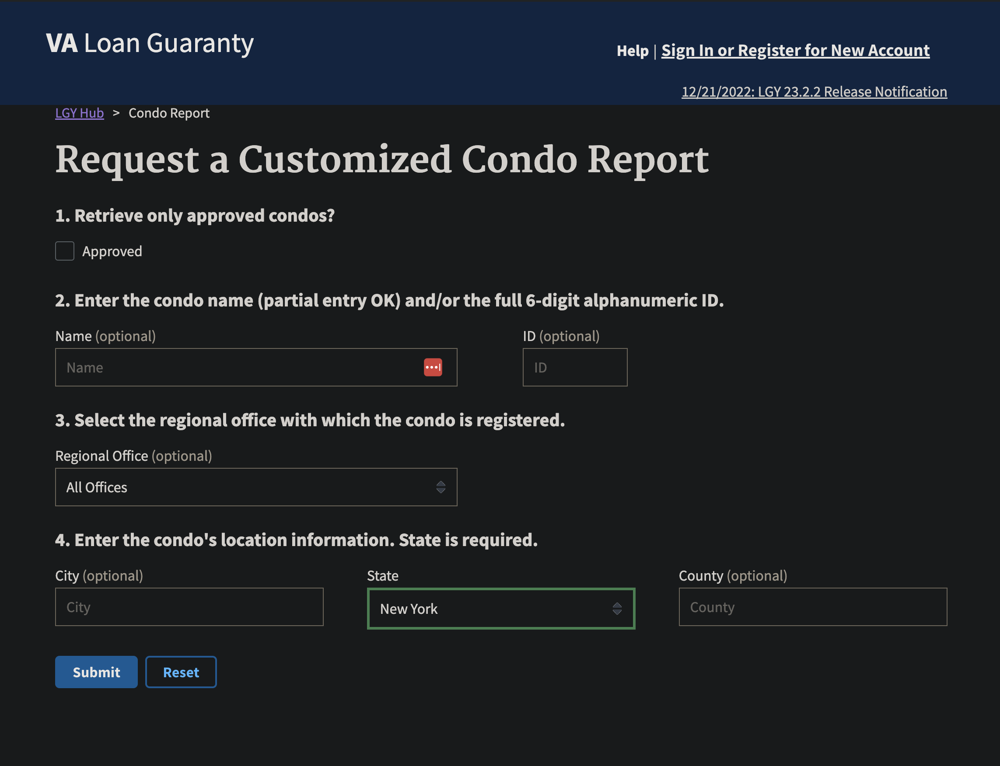
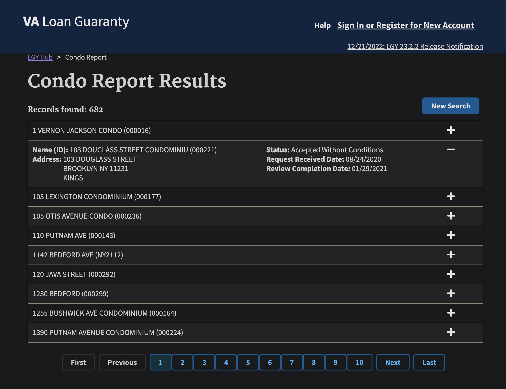

## moodyhome

My wife and I wanted to take advantage of the VA loan to purchase a condo. However, we realized early in our search that the condo would have to be VA approved, which limited the pool of our selection. I decided to make a little side project to help us out. I'm calling it **moodyhome** after my wife's for-fun vintage goods store [@moody__room](https://www.instagram.com/moody__room).

I found that the VA maintains a list of approved condos. If the condo is not on the list, the project must be submitted to the VA for review to ensure that it complies with VA requirements. 

This is the [web UI](https://lgy.va.gov/lgyhub/condo-report) that pulls up condos and their VA approval status in a given area based on the search criteria.

This is an example of the condo results for a given search.

The results provide the:
- condo name
- address
- VA approval status
- request received date
- review completion date
Although the results are informative, it provided little in ease of use for navigating the results. More importantly, there was no way to export the results to use in any meaningful way. They also had historical listings that were VA approved, but no longer for sale. 

I wrote a python script (`moodyhome/lgy_ingest.py`) to scrape and ingest the raw data from the search results using bs4. I was able to process the data and push the raw json objects into an S3 bucket I created using AWS free tier. 

I ended up parameterizing the python script to take in geographic locations from the handful of cities we were open to. I did this by creating a config file that defined the search criteria for each location (`moodyhome/config/lgy_search_config.yaml`). The script would iterate on each city and scrape the results and push them to my S3 bucket using some helper functions in a utils module (`moodyhome/moodyutils.py`). I also added a semantic layer to the payload being ingested such as `ingestion_timestamp`.

I had the data for VA approved condos, but now I realized the next pain point was in getting details about the condo. The results didn't show much outside of the approval status, so I wrote another script (`moodyhome/zillow_ingest.py`) to ingest home listings from Zillow using a similar search criteria. I also added in parameterizing the search with budget as well. With this script, I was able to pull listings with the following details:
- size in sqft
- price
- listing url
- availability date
- etc.

## to-do

Now that I have two pipelines ingesting the LGY and Zillow listings, I need a way to compare the two and find any existing VA approved condos that were listed for sale on Zillow. I also want to pull any new listings that meet these requirements. I currently have DBT models to clean up the data and loaded into tables. 

I need to create a new model that can combine the two models using a join query possibly based on some intelligent matching of the listings. One possible course of action could be using the Levenshtein distance between address string and returning listings that meet a specified distance threshold deeming a quality match. This would expose any up to date listings that are potential candidates for my wife and I to look into.

I previously had a couple scripts that loaded the raw data in s3 into Postgres tables on AWS on a daily cron schedule, but I ended up scrapping it to explore using a personal Snowflake account. I tested a 30-day free trial on Snowflake, and I was able to create a storage integration with a stage that reads the data in my s3 bucket without the need to create additional scripts to load them. I could then create a Snowflake table and set a Snowpipe to stream any new data loaded into S3 into that table (all managed my Snowflake's compute). Then, I could reference that table as a source in DBT to run my transform models to materialize my following tables. The Snowflake architecture should be pretty simple and easy to manage. i'll also have to calculate costs lol.

My 2 tables are also super wide right now. I should normalize them, but I need to think a little more about how I want the end product to look before I start modeling. 

Eventually, I can possibly split the ingestion and dbt parts of this project and build Jenkins pipelines for them and TBD on what to do for orchestration.
**